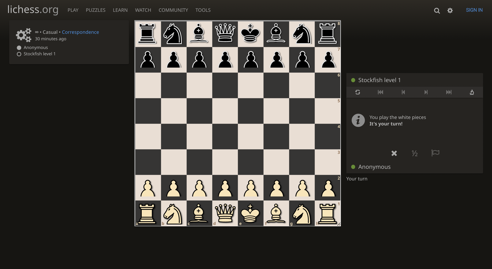

# My Lichess

This is a simple Chrome extension, which I made for toying around with [lichess](https://lichess.org/).

It basically changes the board and chess pieces appearance according to the user.

## Build

It does not require much work. One can simply download the source files, and can load unpacked to their browser.
Refer [here](https://developer.chrome.com/docs/extensions/mv3/getstarted/development-basics/#:~:text=%23%20Loading%20an%20unpacked%20extension,the%20bottom%20of%20the%20menu.).

## How it looks

This is how it currently looks
